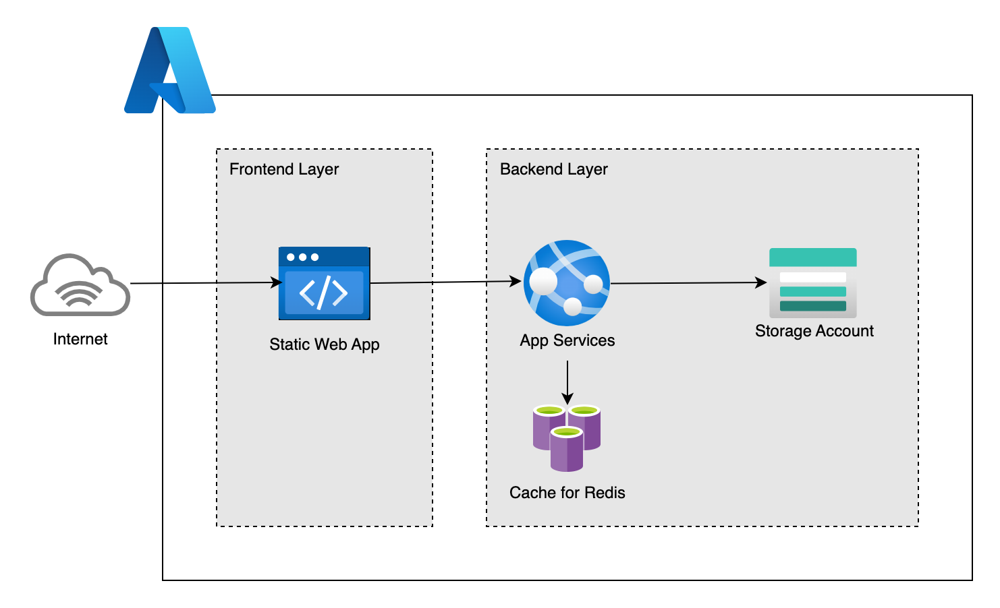

# 静的ホスティング＋API＋キャッシュの統合Webシステム

  

## システム概要

このリポジトリは、Docker Composeを利用してローカルでAzure Static Web Apps + API + Redis + Azurite環境を構築・検証できるプロジェクトです。

### 主な構成

- **フロントエンド**: Next.js (React)
- **バックエンド**: Flask API
- **キャッシュ**: Redis
- **ストレージ**: Azurite

### バックエンドAPI（ポート: 8000）

- `/health` - 各サービスのヘルスチェック
- `/redis-test` - Redis接続テスト
- `/upload` - Azure Blob Storageへのファイルアップロード

### Redis（ポート: 6379）

- インメモリデータストア
- キャッシュ用途

### Azurite（ポート: 10000）

- ローカルAzureストレージエミュレータ
- Blobストレージエンドポイント

## 起動の流れ

### 1. インフラ構築
`bin/terraform_apply` を実行してインフラを構築します。

### 2. デプロイトークン取得
AzureポータルでStatic Web Appにアクセスし、デプロイトークンを取得します。

### 3. Secrets設定
取得したトークンをGitHubリポジトリのSecretsに設定します（例: `AZURE_STATIC_WEB_APPS_API_TOKEN`）。

### 4. リポジトリへのプッシュ
`git push` でリポジトリにプッシュします。

### 5. 自動デプロイ
GitHub Actionsが自動的にデプロイを実行します。

### 6. 動作確認
デプロイ完了後、Static Web AppのURLにアクセスして動作を確認します。
